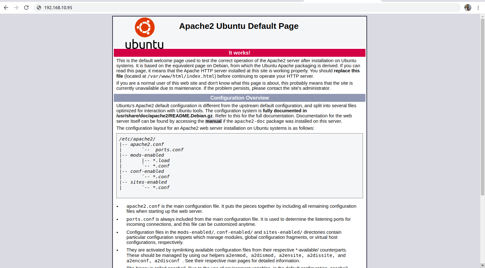

# Web Hosting By Apache apache2 in Ubuntu

## Install Apache apache2 in your system 

```
root@jarvis:~# apt install apache2
```

## Start and enable Apache apache2

```
root@jarvis:~# systemctl enable --now apache2
```
Now for checking that apache2 server is working or not , type your ip in browser <br> and if you see this page then your apache is working !!



## Now for hosting a web page on your server 
### change directory to /var/www/html

Now open any text editor like vim , nano and write your html code under ``` "index.html"  ```

## Configuration of Apache2

The main configuration file of apache2 is ``` /etc/apache2/apache2.conf ``` 


### To change document root , edit in apache2.conf 
``` 
<Directory "/var/www/html">
   
```
### Restart apache2 service
```
root@jarvis:~# systemctl restart apache2
```
### To check status of apache2
```
root@jarvis:~# systemctl status apache2
```

