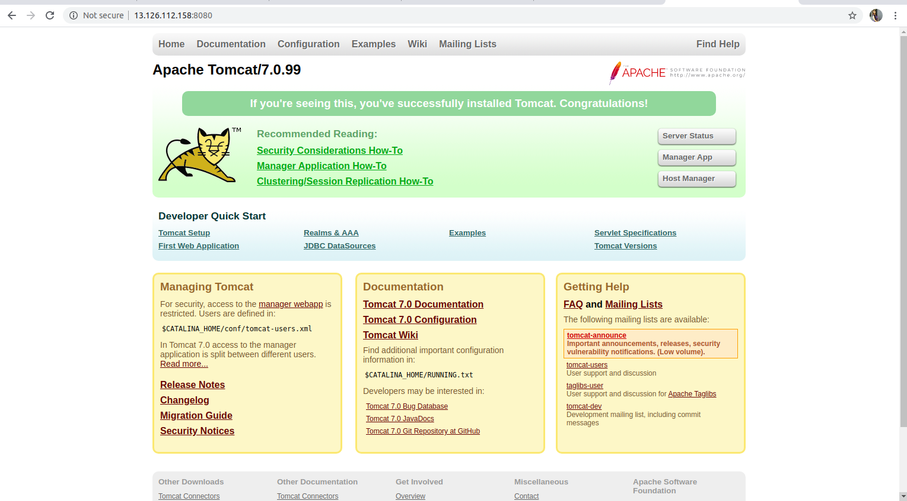

# Tomcat JSP Hosting in redhat

## Install java 
```
root@jarvis:~# yum install java-1.8.0-openjdk-devel
```
## Check version
 
```
root@jarvis:~# java -version
openjdk version "1.8.0_222"
OpenJDK Runtime Environment (build 1.8.0_222-b10)
OpenJDK 64-Bit Server VM (build 25.222-b10, mixed mode)
```

# Install Tomcat

First add group named tomcat 
``` 
root@jarvis:~# groupadd tomcat
```
Add user in tomcat group

```
root@jarvis:~# useradd -g tomcat -d /opt/tomcat -s /bin/nologin tomcat
```

## Download latest version of Apache Tomcat 

```
root@jarvis:~# http://www-us.apache.org/dist/tomcat/tomcat-7/v7.0.99/bin/apache-tomcat-7.0.99.tar.gz
```

Untar the given file

```
root@jarvis:~# tar xzf apache-tomcat-7.0.99.tar.gz
```

Move apache-tomcat to ``` /usr/local/tomcat7 ```

```
root@jarvis:~# mv apache-tomcat-7.0.99 /usr/local/tomcat7

```

## Start Tomcat Server 

```
root@jarvis:~# cd /usr/local/tomcat7
root@jarvis:~# ./bin/startup.sh
Using CATALINA_BASE:   /usr/local/tomcat7
Using CATALINA_HOME:   /usr/local/tomcat7
Using CATALINA_TMPDIR: /usr/local/tomcat7/temp
Using JRE_HOME:        /
Using CLASSPATH:       /usr/local/tomcat7/bin/bootstrap.jar:/usr/local/tomcat7/bin/tomcat-juli.jar
Tomcat started.

```

## Access it in browser

Tomcat works on port 8080 default 



## Run a jsp in Apache tomcat 

Now open any text editor , write code .jsp 

Move the file under ``` /usr/local/tomcat7/webapps/ROOT ```

Start Tomcat server again !!!


