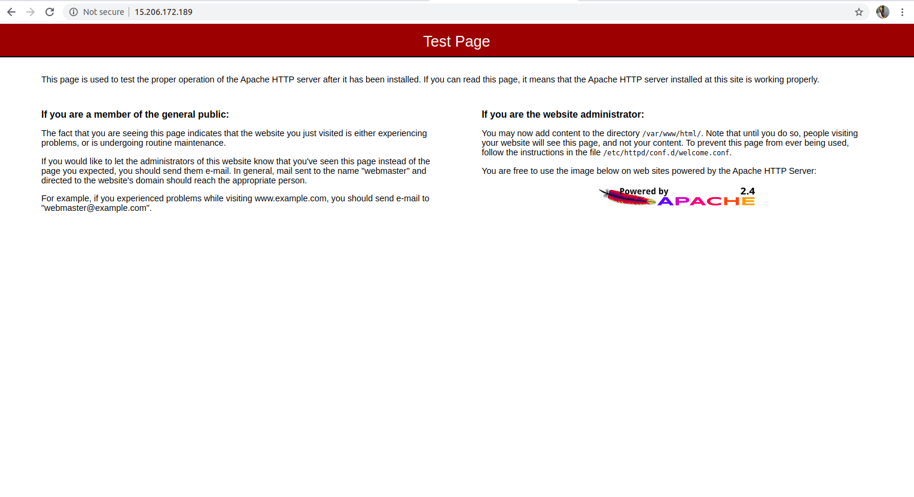

# Web Hosting By Apache Httpd

## Install Apache Httpd in your system 

```
root@jarvis:~# yum install httpd -y
```

## Start and enable Apache Httpd

```
root@jarvis:~# systemctl enable --now httpd 
```
### Now for checking that httpd server is working or not , type your ip in browser <br> and if you see this page then your httpd is working !!



## Now for hosting a web page on your server 
### change directory to /var/www/html

Now open any text editor like vim , nano and write a file named "index.html" 

### Index.html

```
